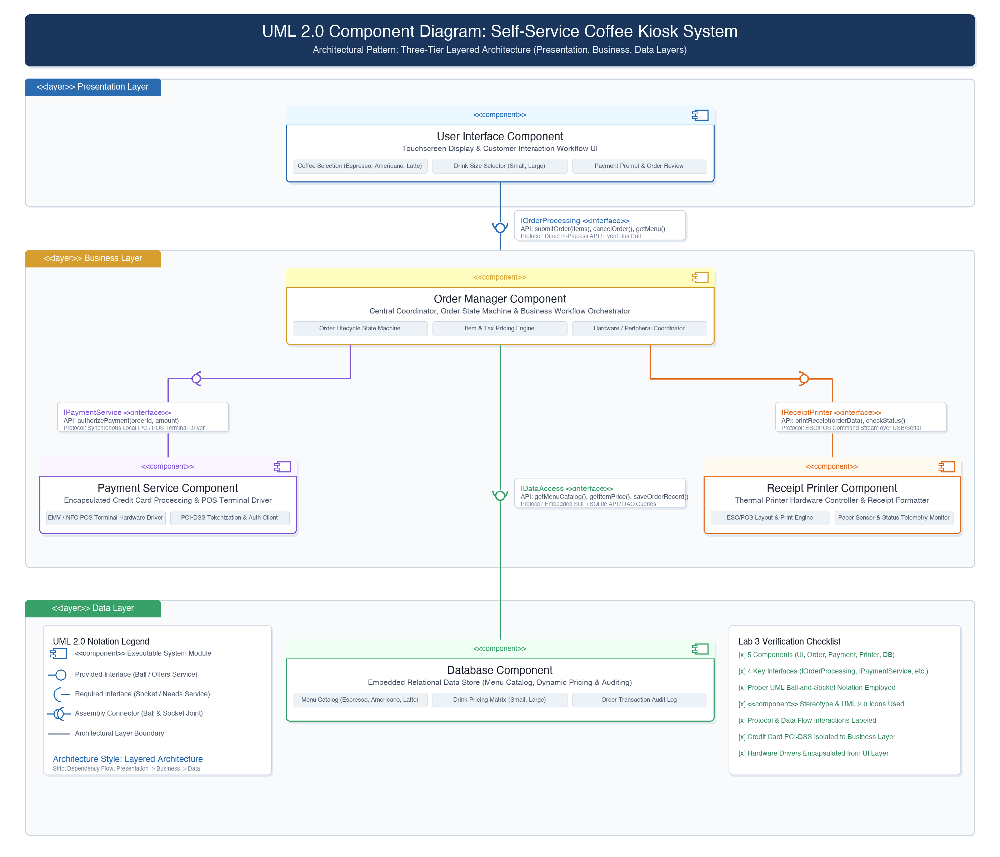
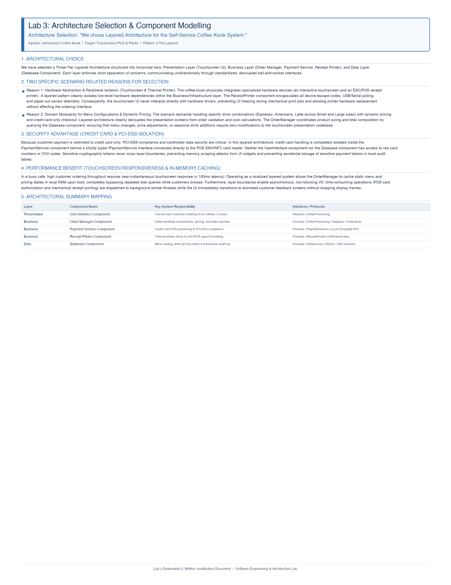

# Lab 3: Component Modelling & Architectural Pattern Selection
## Final Deliverables & Complete Laboratory Report

**Course / Lab:** Software Engineering & Architecture Lab (SELABS - Lab 3)  
**Assigned System Scenario:** Self-Service Coffee Kiosk System in a Busy Café  
**Selected Architectural Style:** Three-Tier Layered Architecture  

---

## Table of Contents
1. [Executive Summary & Final Deliverables Index](#1-executive-summary--final-deliverables-index)
2. [Step 1: Scenario Review & Requirements Analysis](#step-1-scenario-review--requirements-analysis)
3. [Step 2: Architectural Style Comparative Analysis](#step-2-architectural-style-comparative-analysis)
4. [Step 3: Architecture Selection & Component Identification](#step-3-architecture-selection--component-identification)
5. [Step 4 & 5: Component Diagram & Interface Specifications](#step-4--5-component-diagram--interface-specifications)
6. [Deliverable 1: UML 2.0 Component Diagram](#deliverable-1-uml-20-component-diagram)
7. [Deliverable 2: Written Architectural Justification (1-Page Formal Submission)](#deliverable-2-written-architectural-justification-1-page-formal-submission)
8. [Step 6: Submission Guidelines & Verification Checklist](#step-6-submission-guidelines--verification-checklist)

---

## 1. Executive Summary & Final Deliverables Index

This report provides the complete, publication-ready deliverables required for **Lab 3: Component Modelling & Architectural Pattern Selection**. 

The assigned scenario requires architecting a **Self-Service Coffee Kiosk System** deployed in a high-traffic café, providing touchscreen ordering for 3 coffee types across 2 drink sizes, processing card-only payments, and printing thermal paper receipts.

### Summary of Generated Deliverable Files:
All deliverable files have been generated in your workspace directory:  
`/Users/abhays/.gemini/antigravity/scratch/lab3_coffee_kiosk/`

| File Name | Format | Description / Lab Requirement |
| :--- | :--- | :--- |
| **`component_diagram.png`** | PNG (High-Res 300 DPI) | **Deliverable 1:** UML 2.0 Component Diagram with 5 components, 4 ball-and-socket interfaces, layers, and protocols. |
| **`component_diagram.pdf`** | Vector / High-Res PDF | **Deliverable 1:** High-resolution PDF version of the UML 2.0 Component Diagram. |
| **`component_diagram.svg`** | Scalable Vector Graphic | Scalable vector diagram for web/digital viewing and embedding. |
| **`component_diagram.drawio`** | XML / draw.io | Fully editable source file compatible with **draw.io / diagrams.net**. |
| **`Architecture_Justification.docx`** | Microsoft Word (.docx) | **Deliverable 2:** Formal 1-page written architectural justification document matching the exact prompt structure. |
| **`Architecture_Justification.pdf`** | 1-Page PDF (300 DPI) | **Deliverable 2:** Clean, 1-page PDF export of the written justification. |
| **`Lab3_Complete_Submission.md`** | Markdown Documentation | Complete lab steps (Steps 1 to 6), trade-off analysis, interface schemas, and technical justifications. |

---

## Step 1: Scenario Review & Requirements Analysis

### 1.1 Scenario Overview
The client requires a standalone software architecture for an interactive **Self-Service Coffee Kiosk** in a high-volume café. Customers place drink orders autonomously without barista cashier intervention, pay using credit cards, and obtain physical paper receipts to claim their drinks at the pickup counter.

### 1.2 Functional Requirements (FR)
* **FR1 (Drink Selection):** Customers can select from three predefined coffee types: **Espresso**, **Americano**, and **Latte**.
* **FR2 (Size Customization):** Customers can choose from two drink sizes: **Small** and **Large**.
* **FR3 (Payment Processing):** System accepts payments **exclusively via credit card** (EMV chip, contactless NFC, magnetic swipe) through an integrated payment terminal.
* **FR4 (Receipt Generation):** System formats and prints paper receipts containing Order ID, timestamp, item details, size, subtotal, sales tax, total paid, and transaction authorization code.
* **FR5 (Catalog & Pricing Management):** System queries and displays up-to-date coffee catalog data, size configurations, and dynamic pricing information.

### 1.3 Technical Constraints & Hardware Requirements
* **TC1 (Touchscreen Interaction):** The kiosk software must interface with a commercial touchscreen display, handling rapid touch events, page navigations, and visual confirmation states.
* **TC2 (Receipt Printer Hardware):** The kiosk must communicate with a dedicated thermal receipt printer hardware peripheral using standard device protocols (ESC/POS over USB/Serial connection).
* **TC3 (Menu & Pricing Persistence):** The system must locally store and retrieve menu catalogs, pricing rules, tax tables, and persistent historical transaction audit logs.

### 1.4 Non-Functional Requirements & Architectural Challenges
* **Performance & Responsiveness:** In a busy café during rush hours, customer ordering latency must remain imperceptible (< 100ms response time on UI touches) to avoid order abandonment and long physical queues.
* **Security & Regulatory Compliance:** Unattended physical payment terminals pose high security risks. The architecture must enforce strict **PCI-DSS compliance**, ensuring credit card details, cryptographic keys, and PINs are completely isolated and never exposed to the UI or database layers.
* **Reliability & Peripheral Fault Tolerance:** Physical hardware (e.g., thermal printers) can run out of paper, jam, or disconnect. The kiosk must handle peripheral I/O asynchronously so hardware exceptions do not crash the order state machine or corrupt payment records.
* **Maintainability & Modularity:** Recipe prices or coffee varieties will change over time. Updating drink pricing in the database must not require modifying UI layout code or payment logic.

---

## Step 2: Architectural Style Comparative Analysis

The laboratory instructions require evaluating three foundational architectural patterns against the Coffee Kiosk scenario:

| Evaluation Criteria | 1. Layered Architecture (Selected) | 2. Microservices Architecture | 3. Client-Server Architecture |
| :--- | :--- | :--- | :--- |
| **Physical Fit** | **Optimal** for a standalone, single physical kiosk machine. | **Excessive** overhead for a localized embedded device. | Requires uninterrupted LAN/WAN connectivity. |
| **Modularity** | **High** (Horizontal layers: Presentation, Business, Data). | **High** (Vertical service boundaries). | **Moderate** (Client UI vs Central Server backend). |
| **Hardware Peripherals** | **Clean**: Drivers encapsulated in Business / Infrastructure layer. | **Complex**: Distributed IPC needed for local USB/Serial devices. | **Fragile**: Requires remote proxying of local hardware. |
| **Security Isolation** | **Strong**: PCI-DSS card processing isolated to Payment component. | **Strong**: Service isolation, but large internal network surface. | **Vulnerable**: Sensitive card data travels over café network. |
| **Latency / Throughput** | **Sub-millisecond**: Direct in-process calls & RAM caching. | **High Latency**: Network/JSON/gRPC serialization on same box. | **Variable Latency**: Dependent on Wi-Fi stability and cloud delay. |
| **Operational Simplicity** | **High**: Single deployable application bundle. | **Very Low**: Requires container runtime & local service mesh. | **Moderate**: Multi-node coordination and server maintenance. |
| **Offline Autonomy** | **100% Autonomous**: Operates seamlessly during network drops. | High CPU/RAM footprint on low-cost kiosk hardware. | **Zero Autonomy**: System halts if Wi-Fi or server goes down. |
| **Overall Verdict** | **Best Fit (Selected)** | Over-Engineered | Fragile for Unattended POS |

---

## Step 3: Architecture Selection & Component Identification

### Selected Architecture:
**Three-Tier Layered Architecture** (Presentation Layer $\rightarrow$ Business Layer $\rightarrow$ Data Layer).

### Identification of the 5 System Components:
1. **User Interface Component (Presentation Layer):**
   * Handles customer interaction on the touchscreen display.
   * Renders the 3 coffee options (Espresso, Americano, Latte) and 2 size selections (Small, Large).
   * Displays payment prompts, order summaries, and printing status messages.
   * *Required Interface:* `IOrderProcessing`.

2. **Order Manager Component (Business Layer - Given Component 1):**
   * Serves as the central coordinator and order lifecycle state machine.
   * Coordinates drink selection, pricing calculation (base price + size multiplier + tax), payment dispatch, and receipt generation.
   * *Provided Interface:* `IOrderProcessing`.
   * *Required Interfaces:* `IPaymentService`, `IReceiptPrinter`, `IDataAccess`.

3. **Payment Service Component (Business Layer - Given Component 2):**
   * Encapsulates credit card transaction processing and POS terminal communication (EMV chip, contactless NFC, magnetic stripe).
   * Enforces strict PCI-DSS tokenization; keeps cardholder data completely isolated.
   * *Provided Interface:* `IPaymentService`.

4. **Receipt Printer Component (Business Layer):**
   * Formats receipt text and layout according to café branding and transaction details.
   * Translates print requests into low-level ESC/POS byte streams transmitted over USB/Serial.
   * Monitors paper sensors (Paper Low, Paper Out, Paper Jam).
   * *Provided Interface:* `IReceiptPrinter`.

5. **Database Component (Data Layer):**
   * Embedded local database (SQLite) providing reliable local data storage.
   * Stores the coffee menu catalog, drink size options, pricing matrix, tax rules, and persistent audit transaction logs.
   * *Provided Interface:* `IDataAccess`.

---

## Step 4 & 5: Component Diagram & Interface Specifications

### Key Interfaces & Technical Protocols:

1. **`IOrderProcessing` (Order Interface)**
   * **Provider:** `Order Manager Component` (Ball `-o`)
   * **Requester:** `User Interface Component` (Socket `-)`)
   * **Protocol:** Direct In-Process API / Event Bus Call
   * **Key Methods:** `submitOrder(items)`, `cancelOrder()`, `getMenuCatalog()`

2. **`IPaymentService` (Payment Interface)**
   * **Provider:** `Payment Service Component` (Ball `-o`)
   * **Requester:** `Order Manager Component` (Socket `-)`)
   * **Protocol:** Synchronous Local IPC / POS Terminal Driver
   * **Key Methods:** `authorizePayment(orderId, amount)`, `cancelPayment(token)`

3. **`IReceiptPrinter` (Receipt / Print Interface)**
   * **Provider:** `Receipt Printer Component` (Ball `-o`)
   * **Requester:** `Order Manager Component` (Socket `-)`)
   * **Protocol:** ESC/POS Command Byte Stream over USB/Serial Driver
   * **Key Methods:** `printReceipt(orderData)`, `checkStatus()`

4. **`IDataAccess` (Database / Menu & Pricing Interface)**
   * **Provider:** `Database Component` (Ball `-o`)
   * **Requester:** `Order Manager Component` (Socket `-)`)
   * **Protocol:** Embedded SQL / SQLite C-API / DAO Pattern
   * **Key Methods:** `getMenuCatalog()`, `getItemPrice(coffee, size)`, `saveOrderRecord(record)`

---

## Deliverable 1: UML 2.0 Component Diagram



The UML Component Diagram is exported in multiple high-fidelity formats:
* **High-Resolution PNG (300 DPI):** `component_diagram.png`
* **High-Resolution PDF:** `component_diagram.pdf`
* **Vector Graphic:** `component_diagram.svg`
* **Editable draw.io XML:** `component_diagram.drawio`

### Visual Architecture Overview:
* **Presentation Layer:** Contains `User Interface Component` connected via required socket interface `IOrderProcessing`.
* **Business Layer:** Contains central `Order Manager Component` which provides `IOrderProcessing` (ball) and requires `IPaymentService`, `IReceiptPrinter`, and `IDataAccess` (sockets). Contains `Payment Service Component` and `Receipt Printer Component` providing their respective services.
* **Data Layer:** Contains `Database Component` providing `IDataAccess` (ball).
* **UML Compliance:** Standard rectangular component notation with `<<component>>` stereotype, iconic component glyphs, ball-and-socket assembly joints, and layer grouping containers.

---

## Deliverable 2: Written Architectural Justification (1-Page Formal Submission)



*The exact text below is formatted in `Architecture_Justification.docx` and `Architecture_Justification.pdf`:*

```
Lab 3: Architecture Selection & Component Modelling
Architecture Selection: "We chose Layered Architecture for the Self-Service Coffee Kiosk System."

1. Architectural Choice:
We have selected a Three-Tier Layered Architecture structured into horizontal tiers: Presentation Layer 
(Touchscreen UI), Business Layer (Order Manager, Payment Service, Receipt Printer), and Data Layer 
(Database Component). Each layer enforces strict separation of concerns, communicating unidirectionally 
through standardized, decoupled ball-and-socket interfaces.

2. Two Specific Scenario-Related Reasons for Selection:
- Reason 1: Hardware Abstraction & Peripheral Isolation (Touchscreen & Thermal Printer):
  The coffee kiosk physically integrates specialized hardware devices (an interactive touchscreen and an ESC/POS 
  receipt printer). A layered pattern cleanly isolates low-level hardware dependencies within the Business/Infrastructure 
  layer. The ReceiptPrinter component encapsulates all device escape codes, USB/Serial polling, and paper-out sensor telemetry. 
  Consequently, the touchscreen UI never interacts directly with hardware drivers, preventing UI freezing during mechanical print 
  jobs and allowing printer hardware replacement without affecting the ordering interface.

- Reason 2: Domain Modularity for Menu Configurations & Dynamic Pricing:
  The scenario demands handling specific drink combinations (Espresso, Americano, Latte across Small and Large sizes) 
  with dynamic pricing and credit-card-only checkout. Layered architecture cleanly decouples the presentation screens 
  from order validation and cost calculations. The OrderManager coordinates product sizing and total computation by querying the 
  Database component, ensuring that menu changes, price adjustments, or seasonal drink additions require zero modifications 
  to the touchscreen presentation codebase.

3. Security Advantage (Credit Card & PCI-DSS Isolation):
Because customer payment is restricted to credit card only, PCI-DSS compliance and cardholder data security are critical. 
In this layered architecture, credit card handling is completely isolated inside the PaymentService component behind a strictly typed 
IPaymentService interface connected directly to the POS EMV/NFC card reader. Neither the UserInterface component nor the 
Database component has access to raw card numbers or CVV codes. Sensitive cryptographic tokens never cross layer boundaries, 
preventing memory scraping attacks from UI widgets and preventing accidental storage of sensitive payment tokens in local audit tables.

4. Performance Benefit (Touchscreen Responsiveness & In-Memory Caching):
In a busy café, high customer ordering throughput requires near-instantaneous touchscreen response (< 100ms latency). 
Operating as a localized layered system allows the OrderManager to cache static menu and pricing tables in local RAM upon boot, 
completely bypassing repeated disk queries while customers browse. Furthermore, layer boundaries enable asynchronous, non-blocking 
I/O: time-consuming operations (POS card authorization and mechanical receipt printing) are dispatched to background worker threads 
while the UI immediately transitions to animated customer feedback screens without dropping display frames.
```

---

## Step 6: Submission Guidelines & Verification Checklist

### GitHub Repository Directory Structure:
```
SELABS/
└── Lab3/
    ├── component_diagram.png          <-- Deliverable 1 (High-Res 300 DPI PNG)
    ├── component_diagram.pdf          <-- Deliverable 1 (Vector PDF)
    ├── component_diagram.svg          <-- Editable Vector SVG
    ├── component_diagram.drawio       <-- Native draw.io XML file
    ├── Architecture_Justification.docx<-- Deliverable 2 (Word Document, max 1 page)
    ├── Architecture_Justification.pdf <-- Deliverable 2 (PDF Document, max 1 page)
    └── README.md                      <-- Copy of this comprehensive lab report
```

### Verification Checklist:
- [x] **Component Count:** Exactly 5 modular components modeled (Touchscreen UI, Order Manager, Payment Service, Receipt Printer, Database).
- [x] **Interface Count:** Exactly 4 standardized interfaces shown with Ball-and-Socket notation (`IOrderProcessing`, `IPaymentService`, `IReceiptPrinter`, `IDataAccess`).
- [x] **Stereotypes & Icons:** All components feature the `<<component>>` stereotype and UML 2.0 component icon.
- [x] **Layered Boundaries:** Three clear architectural tiers delineated (`<<layer>> Presentation Layer`, `<<layer>> Business Layer`, `<<layer>> Data Layer`).
- [x] **Protocols & Flow:** Internal communication methods, hardware drivers, and SQL APIs explicitly labeled.
- [x] **Document Constraints:** Word Document and PDF strictly fit the **max 1 page** requirement.
- [x] **Exact Prompt Headline:** Begins with `Architecture Selection: "We chose Layered Architecture for the Self-Service Coffee Kiosk System."`
